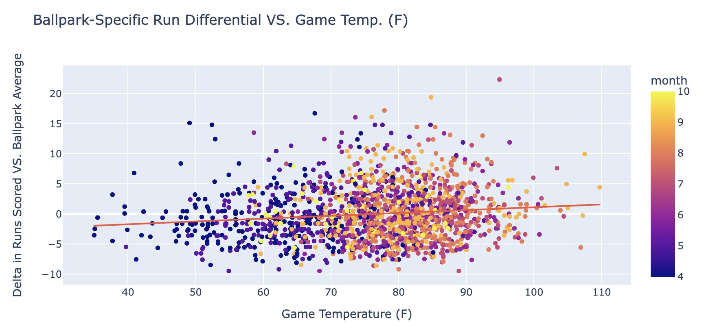
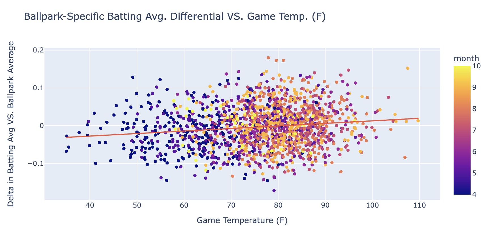
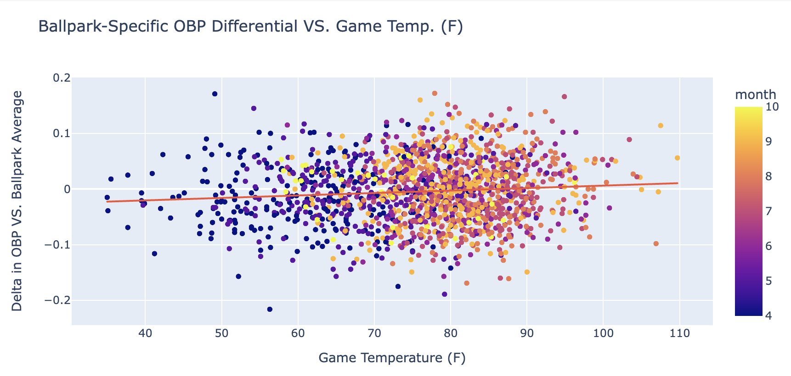
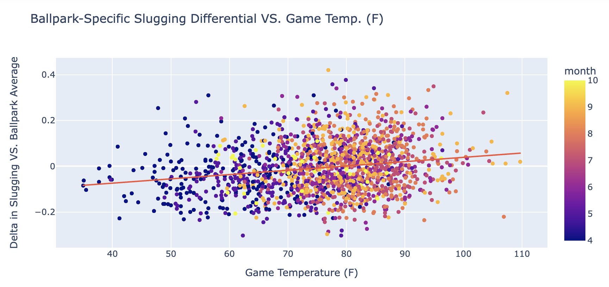

## Do Hotter Outside Temperatures Lead to Greater Offensive Productivity in Major League Baseball?

In order to answer the above, we will take a look at the 4 main offensive productivity metrics: `Runs Scored`, `Batting Average`, `On Base Percentage`, & `Slugging Percentage`. However these 4 statistics may be skewed by the ballpark in which the game is played in (i.e. the confines of The Great American Ballpark are sure to allow greater offensive productivity than those of Oracle Park).

To counteract this, we will be measuring these 4 metrics in differential against the ballpark norm. For example, if the average batting average at Citi Field is .240 and the total batting average in a single game at Citi Field between the 2 teams is .265, the batting average differential for that game will be +.025. We will then be plotting these 4 differentials against the max temperature at that day and location. Now, let's take a look and see if hotter temperatures lead to more offensive efficiency in the last 3 years (2020 - 2022).

### Assumptions:
- Day games take place during that day's max temperature
- Weather only affects offensive production in outdoor environments (even retractable domes are removed due to unclear data on if dome was open or not)

### Process:
To accomplish this, raw data for `teams`, `ballparks`, & `game_logs` were first pulled from [retrosheet](https://www.retrosheet.org/gamelogs/index.html), while weather data was pulled from [open-meteo](https://open-meteo.com/). The data was then loaded, aggregated, and formatted - which is visible in [helpers.load_data.py](https://github.com/jcbfldmn/neo/blob/main/helpers/load_data.py).

Secondly, all of the relevant fields from the above DataFrames were aggregated into one, and all games that were either (__A__) played in a domed stadium or (__B__) played at night were removed (see above assumptions as to why). With this data  it was then necessary to calculate the 4 main offensive metrics to measure efficiency: `Total Runs Scored`, `Batting Average`, `On Base Percentage`,  & `Slugging Percentage` for both every game as well as the average for each ballpark. Once both were calculated, we can use simple subtraction to solve for the delta in all 4 categories for every game played.  All of these calculations are visible in both [helpers.analysis_inputs.py](https://github.com/jcbfldmn/neo/blob/main/helpers/analysis_inputs.py) & [helpers.baseball_functions.py](https://github.com/jcbfldmn/neo/blob/main/helpers/baseball_functions.py)

Finally, the above deltas between offensive stats and ballpark averages were plotted against the temperature for each game, and a trend line was fitted in [offensive_efficiency_vs_temperature.ipynb](https://github.com/jcbfldmn/neo/blob/main/offensive_efficiency_vs_temperature.ipynb), revealing that with all 4 offensive metrics, there was a positive correlation between temperature and offense. The following are the results:

### Conclusion:
So, do hotter temperatures equate to more offense? At least over the last 3 years, the answer seems to be a resounding `YES`. In all 4 major metrics, as game temperature increases, so does the positive metric differential.
